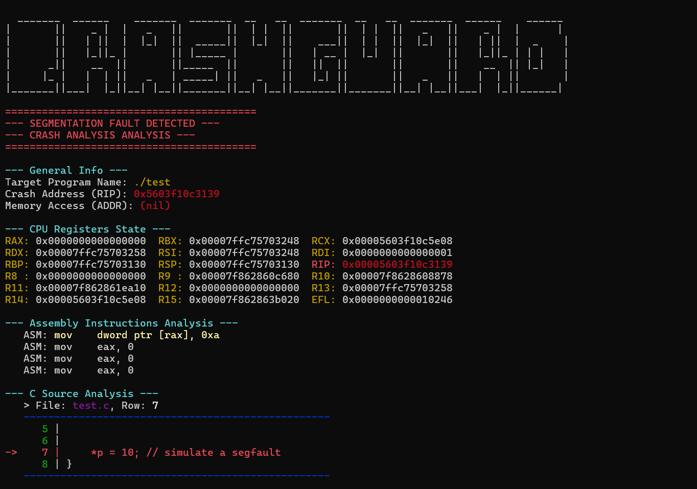

# CrashGuard

### A vigilant guardian for your C/C++ executables. It watches for faulty memory access and perform an analysis.


**CrashGuard** is a lightweight CLI utility for Linux designed for instant post-mortem debugging. It acts as a wrapper: it executes your program, and if it detects a `SIGSEGV` (Segmentation Fault), it freezes execution and shows you exactly what happened, bypassing the complexity of GDB and giving fast and straight-to-the-point useful informations.

## Features

* **Automatic Interception:** Catches crash signals in real-time
* **CPU State:** Full snapshot of CPU registers at the moment of impact
* **Integrated Disassembler:** Uses **Capstone Engine** to display the exact Assembly instruction that caused the crash
* **Source Mapping:** Automatically resolves the memory address to the specific `.c` file and line number (powered by `addr2line`).
* **ASLR/PIE Support:** Automatically calculates the offset to handle modern executables with randomized memory addresses
* **Colored Output:** Clean, high-contrast CLI interface

## How to use

To compile and run CrashGuard, you need a C compiler like `gcc` and a few system libraries. However, I'll provide a statically compiled version in the "Release" section.

To compile on your own, you'll need `gcc` and `libcapstone-dev`. Here's an example for Debian based Linux Distribution:

```bash
# install libcapstone-dev
sudo apt install libcapstone-dev
# compile
gcc main.c -o sfchecker -lcapstone

# run
./sfchecker <target_executable> [executable_args]

```

For full experience (C source mapping), CrashGuard needs `binutils` installed on your system:

```bash
sudo apt install binutils
```

## Why CrashGuard?

### For C Programmers
* **Fix bugs faster:** No need to fire up GDB for every crash. Get the file name and line number of the error instantly
* **Understand the error:** See the exact Assembly instruction that failed, not just a generic "Segmentation Fault" message
* **CI/CD Friendly:** Quickly identify why a build is crashing in your pipeline

### For Security Researchers & CTF Players
* **Exploit Verification:** instantly check if you successfully overwrote the Instruction Pointer (**RIP**)
* **Offset Analysis:** View the exact memory address of the crash to calculate buffer overflow offsets
* **Fuzzing Triage:** Quickly analyze unique crashes generated by fuzzers to determine exploitability
* **ASLR/PIE Handling:** Automatically handles address randomization, making it easier to correlate dynamic memory with static binary analysis

## Example Run




